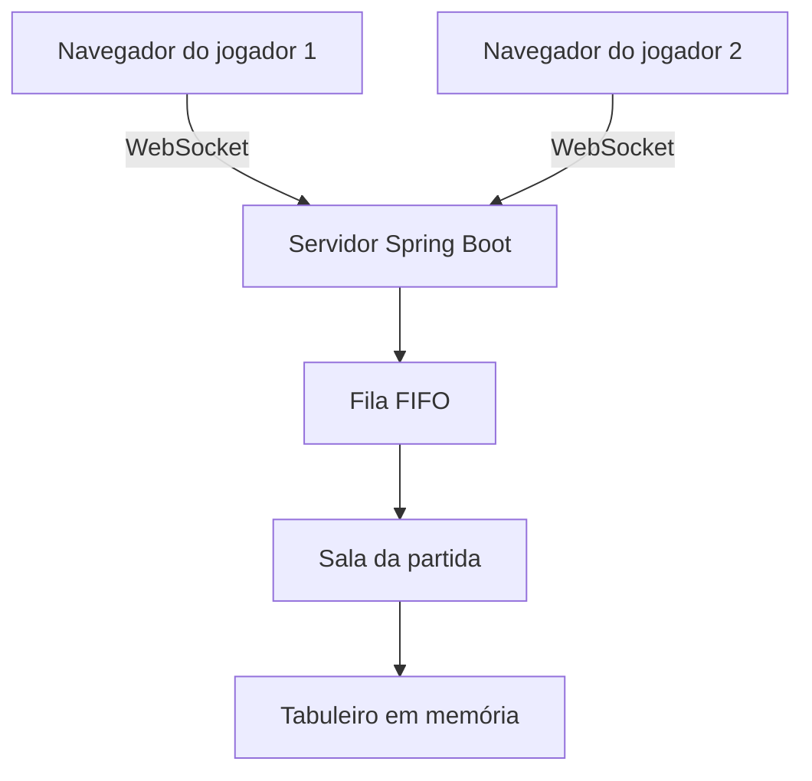

# Damas Online

Jogo de damas multiplayer desenvolvido para o trabalho de **Sistemas Operacionais**, com foco em **troca de mensagens**, **concorrência**, **memória compartilhada**, **escalonamento FIFO** e **exclusão mútua**.

A aplicação utiliza **Spring Boot** no servidor e uma interface web simples construída com **HTML, CSS e JavaScript**. Dois jogadores acessam o mesmo endereço, são alocados automaticamente em uma sala e jogam em tempo real por meio de **WebSocket**.

> O projeto não utiliza banco de dados. As filas, salas, jogadores e partidas permanecem apenas na memória RAM enquanto o servidor estiver em execução.

## Integrantes

- **Aluno 1:** preencher nome
- **Aluno 2:** preencher nome

## Objetivo do trabalho

Implementar um jogo para pelo menos dois usuários, demonstrando conceitos estudados em Sistemas Operacionais:

- comunicação entre processos por sockets;
- troca de mensagens entre jogadores;
- armazenamento de informações em memória compartilhada;
- controle de concorrência;
- exclusão mútua;
- organização dos jogadores por uma fila FIFO;
- sincronização do estado do jogo.

## Como funciona o jogo

O sistema segue o fluxo abaixo:

1. O primeiro jogador acessa a aplicação.
2. O servidor adiciona esse jogador ao final da fila de espera.
3. Enquanto não existe um adversário disponível, a tela exibe a mensagem **Aguardando outro jogador**.
4. Quando o segundo jogador acessa a aplicação, ele também entra na fila.
5. O servidor retira os dois primeiros jogadores da fila, seguindo o método **FIFO** (*First In, First Out*).
6. Uma sala é criada e cada jogador recebe uma cor.
7. O jogador com as peças brancas inicia a partida.
8. Cada movimento é enviado ao servidor, validado e transmitido aos dois jogadores.
9. A partida termina quando um jogador perde todas as peças, fica sem movimentos válidos ou desiste.

## Regra FIFO

A formação das partidas respeita a ordem de chegada dos jogadores. O primeiro jogador que entrou na fila será o primeiro a ser encaminhado para uma sala quando houver outro jogador disponível.

Exemplo:

| Ordem de chegada | Jogador | Situação |
|---:|---|---|
| 1 | João | Aguardando |
| 2 | Maria | Forma uma sala com João |
| 3 | Carlos | Aguardando |
| 4 | Ana | Forma uma sala com Carlos |

No servidor, a fila pode ser mantida por uma estrutura concorrente, como `ConcurrentLinkedQueue`.

## Arquitetura da aplicação



O navegador de cada jogador funciona como um cliente. O Spring Boot funciona como servidor e concentra as regras do jogo, a formação das salas e o estado das partidas.

## Tecnologias utilizadas

- **Java 21**
- **Spring Boot**
- **Spring WebSocket**
- **HTML5**
- **Tailwind CSS**
- **JavaScript**
- **Maven**

## Troca de mensagens

A comunicação em tempo real é realizada com **WebSocket**. Diferentemente de requisições HTTP comuns, o WebSocket mantém uma conexão aberta entre navegador e servidor, permitindo o envio de atualizações durante toda a partida.

As mensagens utilizam JSON e possuem um campo `codigo`, responsável por identificar a ação solicitada.

### Códigos de mensagem

| Código | Finalidade |
|---|---|
| `ENTRAR` | Solicita a entrada do jogador na fila |
| `AGUARDANDO` | Informa que ainda não existe adversário disponível |
| `INICIAR` | Informa que a sala foi formada e inicia a partida |
| `MOVIMENTO` | Envia a origem e o destino de uma peça |
| `ATUALIZAR` | Sincroniza o tabuleiro nos dois navegadores |
| `TROCAR_TURNO` | Informa qual jogador deve realizar a próxima jogada |
| `PROMOCAO` | Informa que uma peça comum se tornou dama |
| `DESISTIR` | Registra a desistência de um jogador |
| `FINALIZAR` | Informa o resultado final da partida |
| `ERRO` | Informa que uma ação ou jogada é inválida |

### Exemplo de movimento

```json
{
  "codigo": "MOVIMENTO",
  "salaId": "SALA-01",
  "jogadorId": "JOGADOR-01",
  "origem": "C3",
  "destino": "D4"
}
```

### Exemplo de atualização enviada pelo servidor

```json
{
  "codigo": "ATUALIZAR",
  "salaId": "SALA-01",
  "jogadorAtual": 2,
  "origem": "C3",
  "destino": "D4",
  "captura": false,
  "promocao": false
}
```

O servidor não confia apenas nas informações enviadas pelo navegador. Antes de atualizar a partida, ele verifica:

- se o jogador pertence à sala;
- se é a vez daquele jogador;
- se a peça selecionada pertence ao jogador;
- se a posição de destino é válida;
- se existe uma captura obrigatória;
- se uma peça deve ser promovida a dama;
- se a partida terminou.

## Gerenciamento de memória

As informações compartilhadas são mantidas na memória do processo do servidor. Entre elas estão:

- fila de jogadores aguardando;
- salas em andamento;
- jogadores de cada sala;
- posição das peças no tabuleiro;
- jogador responsável pelo turno atual;
- histórico necessário para controlar a partida;
- estado da partida: aguardando, em andamento ou finalizada.

As salas podem ser armazenadas em um `ConcurrentHashMap`, utilizando o identificador da sala como chave:

```java
private final Map<String, Sala> salas = new ConcurrentHashMap<>();
```

Como não existe banco de dados, os dados são temporários. Ao encerrar ou reiniciar o servidor, todas as salas e partidas são removidas.

## Memória compartilhada

Os navegadores não acessam diretamente a mesma região de memória. A memória compartilhada existe dentro do servidor Spring Boot: diferentes threads atendem as conexões dos jogadores e acessam os mesmos objetos `Sala` e `Tabuleiro`.

Quando um jogador realiza uma ação:

1. a mensagem chega ao servidor;
2. uma thread processa a solicitação;
3. o objeto da sala é localizado na memória;
4. o servidor bloqueia temporariamente a alteração daquela sala;
5. a jogada é validada e aplicada;
6. o turno é atualizado;
7. o bloqueio é liberado;
8. o novo estado é enviado aos dois jogadores.

## Exclusão mútua

Como os dois jogadores podem enviar mensagens praticamente ao mesmo tempo, é necessário impedir alterações simultâneas no mesmo tabuleiro. Sem esse controle, duas threads poderiam ler e modificar o estado da partida ao mesmo tempo, provocando uma **condição de corrida**.

Cada sala possui seu próprio `ReentrantLock`:

```java
private final ReentrantLock lock = new ReentrantLock();
```

Durante uma jogada, somente uma thread pode alterar a sala:

```java
sala.getLock().lock();

try {
    validarMovimento(sala, movimento);
    executarMovimento(sala, movimento);
    verificarFimDaPartida(sala);
    trocarTurno(sala);
} finally {
    sala.getLock().unlock();
}
```

O bloco `finally` garante a liberação do bloqueio mesmo se ocorrer um erro. Como cada sala possui um lock independente, partidas diferentes podem ser processadas simultaneamente.

## Organização sugerida do código

```text
src/
├── main/
│   ├── java/com/exemplo/damasonline/
│   │   ├── config/
│   │   │   └── WebSocketConfig.java
│   │   ├── controller/
│   │   │   ├── GameController.java
│   │   │   └── WebSocketController.java
│   │   ├── dto/
│   │   │   ├── MensagemJogo.java
│   │   │   └── MovimentoRequest.java
│   │   ├── model/
│   │   │   ├── Jogador.java
│   │   │   ├── Peca.java
│   │   │   ├── Sala.java
│   │   │   └── Tabuleiro.java
│   │   ├── service/
│   │   │   ├── GerenciadorDeSalas.java
│   │   │   └── JogoService.java
│   │   └── DamasOnlineApplication.java
│   └── resources/
│       ├── static/
│       │   ├── css/style.css
│       │   └── js/jogo.js
│       ├── templates/
│       │   └── jogo.html
│       └── application.properties
└── test/
    └── java/com/exemplo/damasonline/
```

## Principais classes

| Classe | Responsabilidade |
|---|---|
| `Jogador` | Guarda identificação, nome, cor e conexão do usuário |
| `Peca` | Representa uma peça comum ou uma dama |
| `Tabuleiro` | Mantém as posições das peças |
| `Sala` | Armazena jogadores, tabuleiro, turno, estado e lock |
| `MensagemJogo` | Padroniza as mensagens enviadas pelo WebSocket |
| `GerenciadorDeSalas` | Controla a fila FIFO e a criação das salas |
| `JogoService` | Valida e executa as regras da partida |
| `WebSocketController` | Recebe ações e envia atualizações aos jogadores |
| `GameController` | Entrega a página web do jogo |

## Como executar

### Pré-requisitos

- Java 21 ou superior;
- Maven 3.9 ou superior;
- navegador web atualizado.

### Pelo terminal

Clone o projeto e acesse a pasta:

```bash
git clone URL_DO_REPOSITORIO
cd damas-online
```

Execute com o Maven Wrapper:

```bash
./mvnw spring-boot:run
```

No Windows:

```powershell
mvnw.cmd spring-boot:run
```

Acesse no navegador:

```text
http://localhost:8080
```

Para testar localmente, abra o endereço em dois navegadores ou em uma janela normal e outra anônima.

## Como gerar o executável

Execute:

```bash
./mvnw clean package
```

O arquivo `.jar` será criado na pasta `target`. Para executá-lo:

```bash
java -jar target/damas-online.jar
```

O nome exato do arquivo pode conter o número da versão configurada no `pom.xml`.

## Possíveis situações tratadas

- jogador aguardando adversário;
- tentativa de jogar fora do próprio turno;
- escolha de uma peça adversária;
- movimento para uma posição inválida;
- captura de peça;
- múltiplas capturas;
- promoção de uma peça para dama;
- desistência;
- desconexão durante a partida;
- vitória por eliminação das peças adversárias;
- vitória quando o adversário não possui movimentos válidos;
- mensagens simultâneas enviadas pelos dois jogadores.

## Demonstração

- **Vídeo de gameplay:** adicionar link
- **Duração solicitada:** aproximadamente 1 minuto

O vídeo deve mostrar, preferencialmente:

1. o primeiro jogador entrando e aguardando;
2. o segundo jogador entrando na mesma sala;
3. o início da partida;
4. a alternância dos turnos;
5. uma movimentação e uma captura;
6. a sincronização do tabuleiro nos dois navegadores;
7. o encerramento da partida.

## Respostas para o formulário

### Explicação sobre o jogo

Damas Online é um jogo multiplayer para dois usuários. Ao acessar a aplicação, cada jogador é inserido em uma fila de espera. O servidor utiliza a política FIFO para reunir os dois jogadores que estão esperando há mais tempo. Após a criação da sala, cada participante recebe uma cor e realiza movimentos alternados. O servidor valida as jogadas, controla o turno, atualiza o tabuleiro e envia o novo estado aos dois navegadores em tempo real.

### Linguagem de programação utilizada

Java com Spring Boot no servidor e HTML, CSS e JavaScript na interface web.

### Como e quais informações são trocadas entre os processos?

A troca de mensagens é feita por WebSocket utilizando objetos no formato JSON. São transmitidos códigos de ação, identificadores do jogador e da sala, posições de origem e destino, turno atual, capturas, promoções, erros e informações de encerramento. O servidor recebe cada ação, valida seu conteúdo, altera o estado da partida e envia a atualização aos dois jogadores.

### Como é realizado o gerenciamento da memória?

As filas, salas, peças, tabuleiros e turnos são armazenados em objetos Java na memória RAM do servidor. As conexões dos jogadores são atendidas por threads que compartilham os objetos correspondentes às partidas. Os dados existem somente enquanto a aplicação estiver em execução.

### Como é feita a exclusão mútua?

Cada sala possui um `ReentrantLock`. Antes de validar e executar uma jogada, a thread precisa obter esse lock. Enquanto uma thread estiver modificando a sala, nenhuma outra poderá alterar o mesmo tabuleiro. Depois da atualização, o lock é liberado em um bloco `finally`. Isso evita condições de corrida e mantém o estado da partida consistente, sem impedir a execução simultânea de jogos pertencentes a salas diferentes.

## Status

Projeto acadêmico em desenvolvimento para a disciplina de **Sistemas Operacionais**.

